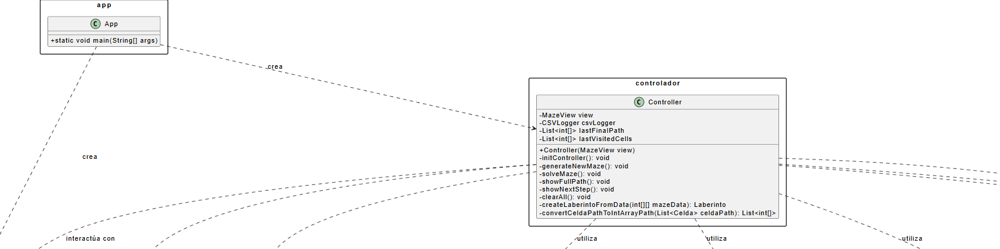
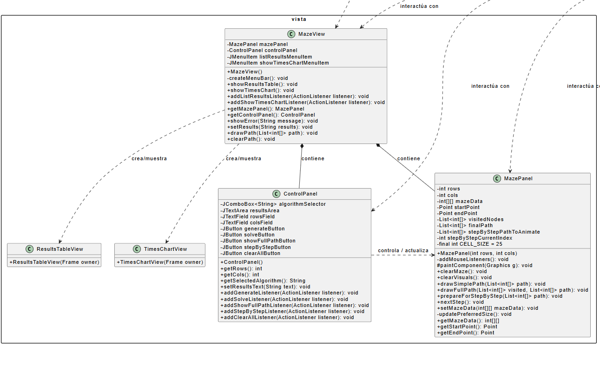
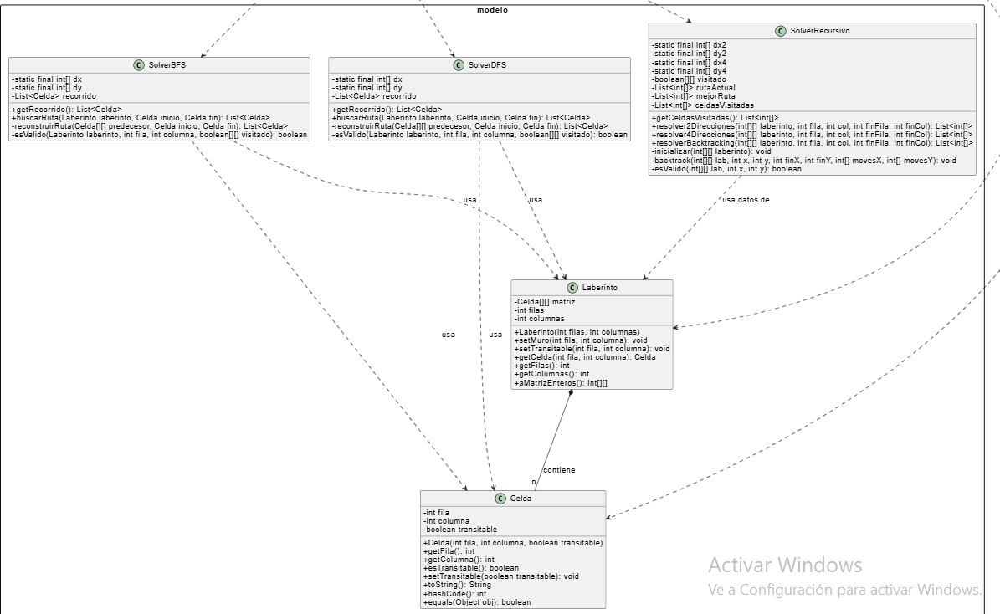
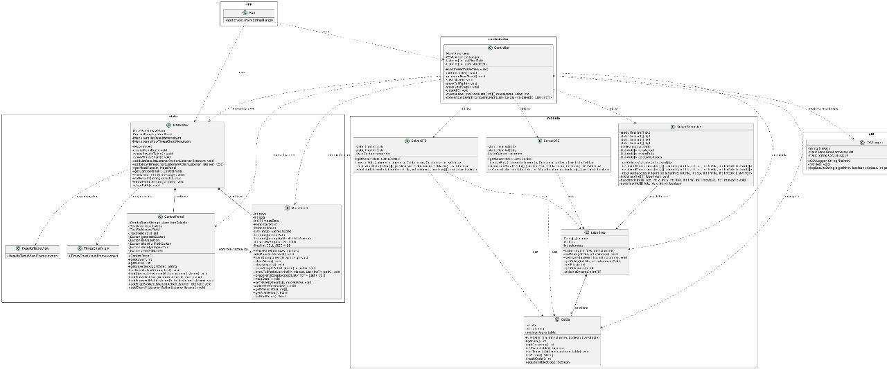

# 🧩 Solucionador de Laberintos con Algoritmos de Búsqueda

## 📌 Información General

* **Título:** Implementación y Comparación Visual de Algoritmos de Búsqueda en Laberintos
* **Asignatura:** Estructura de Datos
* **Carrera:** Computación
* **Estudiantes:** Einar Kaalhus, Israel Orellana, Juan Pablo Ortiz y Mateo Molina
* **Fecha:** 28 de Julio del 2024
* **Profesor:** Ing. Pablo Torres

---

## 📋 Índice

1. [Descripción](#-descripción)
2. [Objetivos](#-objetivos)
3. [Marco Teórico](#-marco-teórico)
4. [Estructura del Proyecto](#-estructura-del-proyecto)
5. [Ejecución](#-ejecución)
6. [Visualización Interactiva](#-visualización-interactiva)
7. [Tabla Comparativa de Complejidad](#-tabla-comparativa-de-complejidad)
8. [Conclusiones](#-conclusiones)
9. [Recomendaciones](#-recomendaciones)
10. [Dependencias](#-dependencias)
11. [Repositorio](#-repositorio)

---

## 🛠️ Descripción

Este proyecto implementa y demuestra visualmente diferentes algoritmos de búsqueda sobre laberintos. La aplicación permite:

* Crear laberintos manualmente.
* Establecer celdas de inicio, fin y muros.
* Seleccionar entre varios algoritmos y observar su comportamiento paso a paso.
* Visualizar rutas exploradas y soluciones.
* Registrar métricas de rendimiento y generar gráficos comparativos.

### Algoritmos implementados:

* **BFS (Búsqueda en Amplitud):** Encuentra la ruta más corta garantizada.
* **DFS (Búsqueda en Profundidad):** Explora profundamente, pero no garantiza la mejor ruta.
* **Backtracking Recursivo (2 y 4 direcciones):** Explora todas las rutas posibles para hallar la óptima.

---

## 🎯 Objetivos

### Objetivo General

Desarrollar una herramienta interactiva en Java para demostrar y comparar visualmente algoritmos clásicos de búsqueda de caminos en laberintos, bajo el patrón MVC.

### Objetivos Específicos

* Implementar los algoritmos BFS, DFS y Backtracking.
* Diseñar una GUI intuitiva con Java Swing.
* Ofrecer retroalimentación visual clara.
* Incluir ejecución paso a paso.
* Registrar métricas en archivos CSV.
* Visualizar datos con gráficos mediante JFreeChart.

---

## 📖 Marco Teórico

### Modelado del Laberinto como Grafo

Cada celda transitable es un nodo. Las conexiones entre celdas son aristas. Los muros son la ausencia de conexiones.

### BFS (Breadth-First Search)

* Explora en niveles (cola FIFO).
* Garantiza la ruta más corta.
* **Complejidad:** O(V + E)

### DFS (Depth-First Search)

* Explora profundamente (pila).
* Más rápida, pero no garantiza óptimo.
* **Complejidad:** O(V + E)

### Backtracking Recursivo

* Explora exhaustivamente todas las rutas.
* Puede encontrar la mejor, pero es costoso.
* **Complejidad:** Exponencial (≈ O(4ⁿ))

### Arquitectura MVC

* **Modelo:** Lógica y estructuras (Celda, Laberinto, Solver).
* **Vista:** GUI con Swing (paneles, gráficos).
* **Controlador:** Conecta acciones del usuario con el modelo y vista.

### JFreeChart y JCommon

* **jfreechart.jar:** Generación de gráficos de líneas.
* **jcommon.jar:** Utilidades complementarias.
* Permiten graficar resultados de los algoritmos desde archivos CSV.

---

## 📁 Estructura del Proyecto

```
.
├── pom.xml                       # Configuración Maven
├── resultados_laberinto.csv     # Registro de tiempos y longitudes
└── src/
    └── main/
        └── java/
            ├── App.java
            ├── controlador/
            │   └── Controller.java
            ├── modelo/
            │   ├── Celda.java
            │   ├── Laberinto.java
            │   ├── SolverBFS.java
            │   ├── SolverDFS.java
            │   └── SolverRecursivo.java
            ├── util/
            │   └── CSVLogger.java
            └── vista/
                ├── ControlPanel.java
                ├── MazePanel.java
                ├── MazeView.java
                └── TimesChartView.java
```

---

## 🚀 Ejecución

### Requisitos:

* Java JDK 11 o superior
* Apache Maven

### Instrucciones:

```bash
git clone https://github.com/EMCMateo/ProyectoFinal-EDD.git
cd ProyectoFinal-EDD
mvn clean install
java -jar target/solucionador-laberintos.jar
```

---

## 👀 Visualización Interactiva

* **Celdas exploradas:** Gris
* **Ruta final encontrada:** Azul
* **Modo paso a paso:** Celdas naranjas
* **Panel de control:** Selección de algoritmo, botones de ejecución y opciones

---

## 📊 Tabla Comparativa de Complejidad

| Algoritmo    | Tiempo Peor Caso | Espacio Peor Caso | ¿Ruta más corta? |
| ------------ | ---------------- | ----------------- | ---------------- |
| BFS          | O(R × C)         | O(R × C)          | ✅ Sí             |
| DFS          | O(R × C)         | O(R × C)          | ❌ No             |
| Backtracking | O(4^R×C)\*       | O(R × C)          | ✅ Sí             |

---

## 📈 Diagrama de Clases








---

## ✅ Conclusiones

1. La visualización mejora la comprensión de los algoritmos.
2. Cada algoritmo tiene sus ventajas según el contexto.
3. MVC ofrece modularidad, claridad y escalabilidad.
4. El análisis cuantitativo valida el rendimiento y comportamiento.

---

## 💡 Recomendaciones

* Implementar algoritmos A\* y Dijkstra.
* Agregar generación automática de laberintos.
* Permitir guardar/cargar laberintos.
* Incluir pruebas unitarias con JUnit.
* Unificar salidas con una clase `AlgorithmResult`.

---

## 📦 Dependencias

* Java JDK 11 o superior
* Apache Maven
* `jfreechart.jar` y `jcommon.jar` para gráficos
